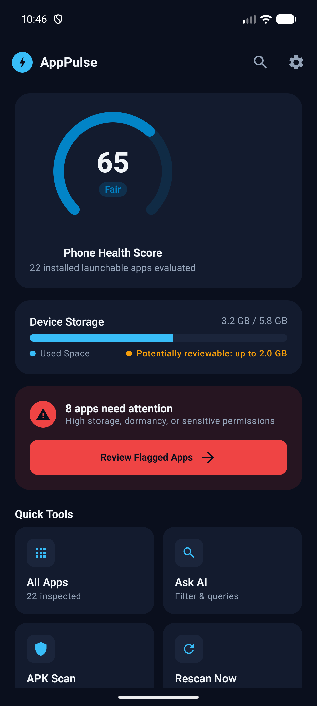
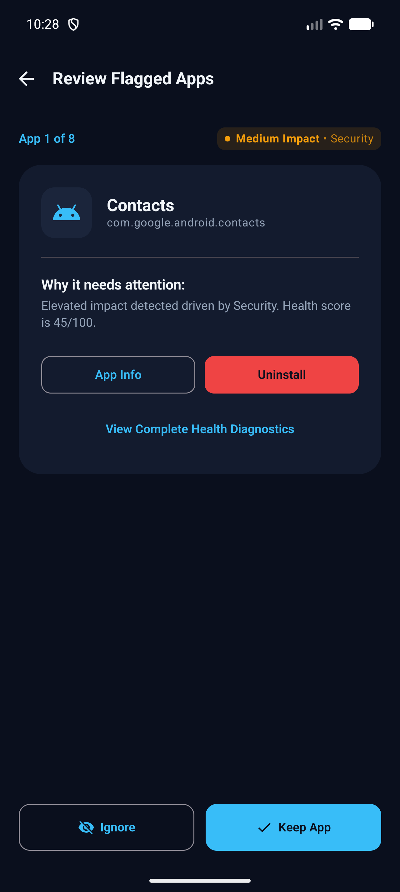
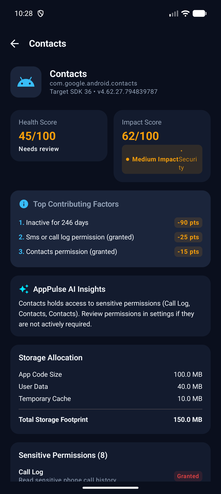
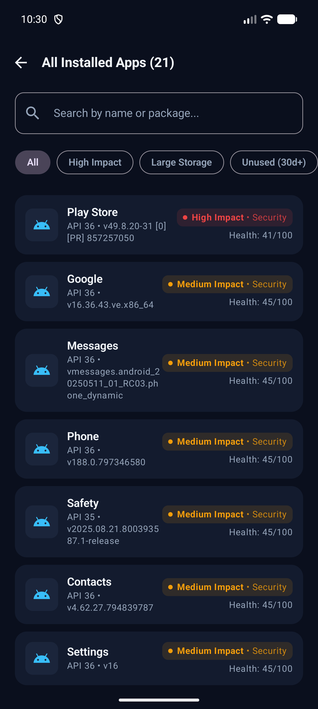
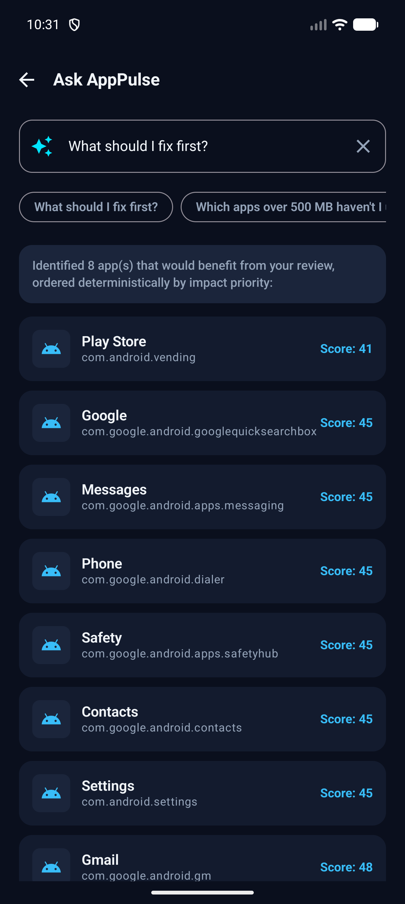
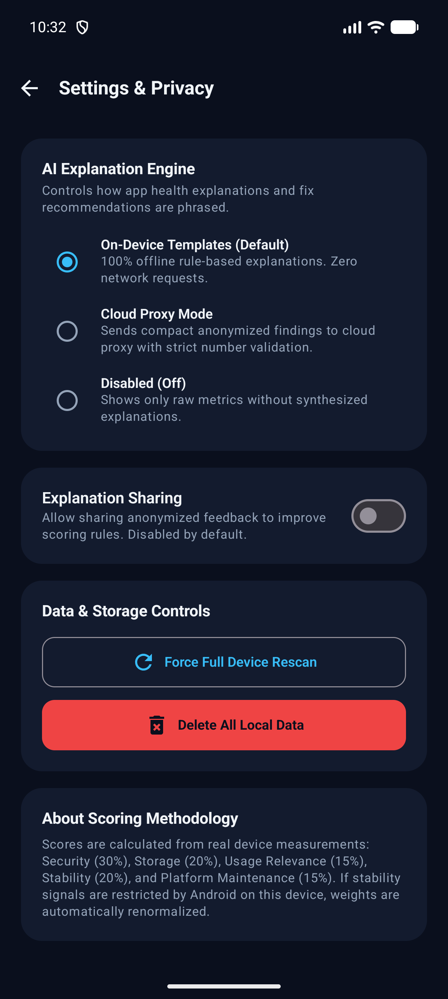
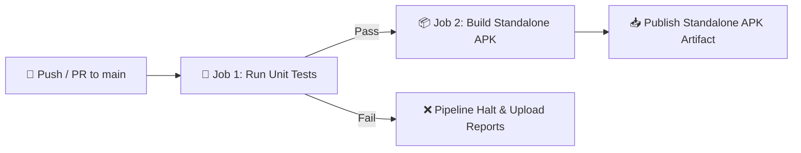

<div align="center">

# ⚡ AppPulse
### Intelligent, On-Device Android Health & Resource Impact Manager

[](https://github.com/Bit-manipulators/App_pulse/actions/workflows/android-ci.yml)
[](https://kotlinlang.org/)
[](https://developer.android.com/jetpack/compose)
[-34A853?style=for-the-badge&logo=android&logoColor=white)](https://developer.android.com/)
[](#-privacy--security-by-default)
[](LICENSE)

<br/>

**A transparent, privacy-first Android platform delivering deterministic scores and actionable recommendations to optimize storage, battery drain, and app permissions.**

</div>

---

## 🌟 Overview

**AppPulse** revolutionizes mobile device maintenance by replacing sketchy "cleaner" gimmicks with **rigorous, deterministic mathematics**, **complete privacy**, and **explainable on-device AI**.

Most phone cleaners push deceptive scare tactics, terminate background tasks indiscriminately, or covertly siphon installed application inventories to remote advertising servers. **AppPulse takes the exact opposite approach**:
- 🔒 **Zero Data Leaves Your Device**: 100% of telemetry, storage statistics, and permissions remain in encrypted on-device SQLite storage.
- 📐 **Deterministic Scoring Engine**: App Health (0–100), Resource Impact (0–100), and Phone Health (0–100) are computed via reproducible mathematical formulas.
- 💡 **Explainable Insights**: No app is flagged without showing the exact point deductions and root causes.
- ⚡ **Non-Destructive Actions**: Provides guided shortcuts to standard Android system sheets rather than forceful, destructive kills.

---

## 📸 App Showcase

<div align="center">

| ⚡ **Dashboard** | 🔍 **Review Flagged** | 📊 **Health Diagnostics** |
| :---: | :---: | :---: |
|  |  |  |
| *Real-time Phone Health & Storage Meter* | *Priority "Fix First" Card Deck* | *Point Deductions & Storage Breakdown* |

| 📱 **All Apps Directory** | 💬 **Ask AI (NLQ)** | 🛡️ **Privacy & Settings** |
| :---: | :---: | :---: |
|  |  |  |
| *Filterable App Inventory & Search* | *On-Device Semantic Query Engine* | *Zero-Upload Privacy Controls* |

</div>

---

## 🚀 Core Features

### 1. ⚡ Real-Time Mobile Phone Performance
- Displays live hardware telemetry upon opening the app: **RAM Memory** (used, available headroom, percentage load), **Internal Storage** (used, free space, percentage capacity), **CPU Cores**, **Device Model**, and **OS Version**.
- Computes a dynamic **Phone Vitality Index** categorized into *Optimal*, *Good*, *Moderate*, and *Heavy Load*.

### 2. 🔐 Aggregated Application Access & Permissions
- Transparently audits installed applications to show counts granted sensitive privileges:
  - 📍 **Location** (Fine, Coarse & Background)
  - 📷 **Camera**
  - 🎙️ **Microphone**
  - 💬 **SMS & Call Logs**
  - 👥 **Contacts**

### 3. 🤖 Performance AI Assistant (Powered by Qwen 2.5 Coder via Ollama)
- Interactive on-device performance chat powered by local **Ollama** running `qwen2.5-coder:3b`.
- Context-aware intelligence fed with actual hardware metrics and permission access data.
- Quick prompt chips for instant answers on RAM vitality, permission auditing, storage optimization, and background battery drain without sending personal data to the cloud.

### 4. 🎯 Selective On-Demand App Testing & Parameter Analysis
- **Zero Batch Lag**: Does not scan and score all 80+ applications at once on startup. Instead, users selectively choose which application they want to test.
- Customizable parameter options:
  - 🛡️ **Security & Permissions Risk**: Evaluates sensitive privileges, background access, and component blast radius.
  - 💾 **Storage Footprint**: Measures code size, user data, and temporary cache bloat.
  - ⏱️ **Usage & Inactivity**: Audits screen time, launch frequency, and dormancy windows.
  - ⚡ **Stability & Background Impact**: Checks crash frequency, ANR exits, and memory pressure.
- Runs local Qwen AI inference to generate an objective 3-part assessment with real metrics and actionable user steps.

---

## 🏗️ Architecture & Clean Design

AppPulse follows strict Clean Architecture guidelines with two isolated modules:

```
AppPulse
├── :core-scoring     # Pure Kotlin module. Zero Android SDK dependencies.
│                     # Contains HealthScorer, ImpactScorer, PhoneHealthScorer.
└── :app              # Android Jetpack Compose application module.
                      # Contains Room DB, System Collectors, UI Screens, and AI engine.
```

- **MVI / Unidirectional Data Flow**: State is exposed via Kotlin `StateFlow` and consumed seamlessly in Compose.
- **Room SQLite Persistence**: Caches snapshots, score histories, metrics logs, and user dismiss decisions locally.
- **Strict Claims Policy**: UI microcopy is certified non-alarmist. We use *"elevated impact"*, *"review recommended"*, and *"dormant app"* instead of fear-mongering terms like *"virus"*, *"critical danger"*, or *"malware"*.

For complete engineering details and mathematical formulas, see [PROJECT_BRAIN.md](PROJECT_BRAIN.md).

---

## 🛠️ Tech Stack

- **Language:** [Kotlin 2.0.21](https://kotlinlang.org/)
- **UI Toolkit:** [Jetpack Compose](https://developer.android.com/jetpack/compose) with [Material 3](https://m3.material.io/)
- **Local Database:** [Room SQLite 2.6.1](https://developer.android.com/training/data-storage/room)
- **Preferences:** [DataStore Preferences](https://developer.android.com/topic/libraries/architecture/datastore)
- **JSON Engine:** [Google Gson](https://github.com/google/gson)
- **Build System:** Gradle 8.13 with Kotlin DSL & Android Gradle Plugin 8.9.0
- **Testing:** JUnit 4 + Compose UI Testing

---

## 🚀 Getting Started

### Prerequisites
- Android Studio Ladybug / Meerkat or IntelliJ IDEA
- JDK 17 or higher
- Android SDK with API 35/36 installed

### Build & Run
```bash
# Clone the repository
git clone https://github.com/Bit-manipulators/App_pulse.git
cd App_pulse

# Run scoring engine unit tests
./gradlew :core-scoring:test

# Build the debug APK
./gradlew :app:assembleDebug

# Install on a connected device/emulator
adb install -r app/build/outputs/apk/debug/app-debug.apk
```

---

## 🔄 Automated CI/CD Pipeline

AppPulse includes a robust **GitHub Actions** CI/CD pipeline (`.github/workflows/android-ci.yml`) that triggers on every push and pull request to `main`:



1. **🧪 Automated Testing Stage**:
   - Executes all pure Kotlin scoring engine unit tests (`:core-scoring:test`).
   - Executes all Android app unit tests (`:app:testDebugUnitTest`).
   - Automatically archives test reports as run artifacts.
2. **📦 Standalone Build & Packaging Stage**:
   - Compiles and packages `app-debug.apk`.
   - Verifies the output binary integrity.
   - Automatically uploads `AppPulse-Standalone-APK` as a downloadable artifact on GitHub Actions.

---

## 📄 License

Distributed under the MIT License. See `LICENSE` for details.
